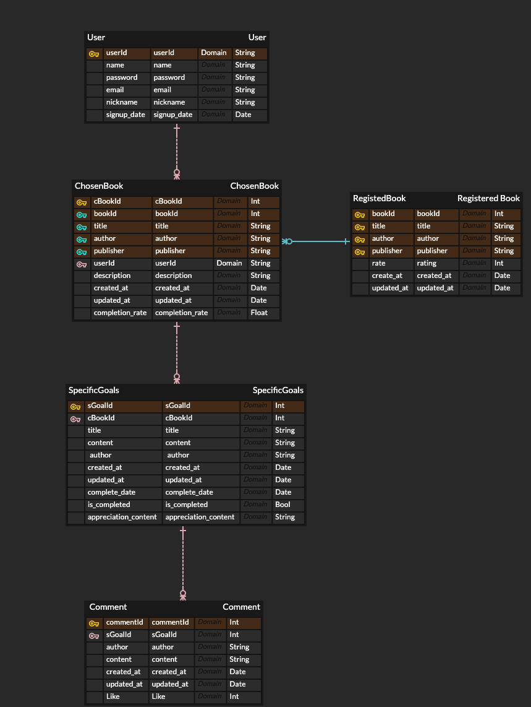

# 📚 북적북적
> Made by : dellyu03  
> 인프런 워밍업 클럽 2기 백엔드 프로젝트 과정 중

 

## 📕 프로젝트 소개
- 독서 습관을 만들고 싶지만 혼자서는 힘들었던 사람들을 위해 만든 프로젝트
- 책을 선정해서 목표를 정해서 읽고 다른 사람들과 감상을 공유하는 사이트
- 사용자는 읽고자 하는 책과 책 읽기 계획을 정하여 다른 사람들과 공유할 수 있다.
- 각 목표 완수시마다 책에 대한 감상이나 내용정리를 적고 다른 사람들과 공유할 수 있다.
- 다른 사용자의 글을 구경할 수 있고 좋아요와 댓글을 달 수 있다.

 

## 📗 사용 기술 스택

### 🖥 Language

### 🛠 FrameWork

 

 

## 프로젝트 ERD 구성

